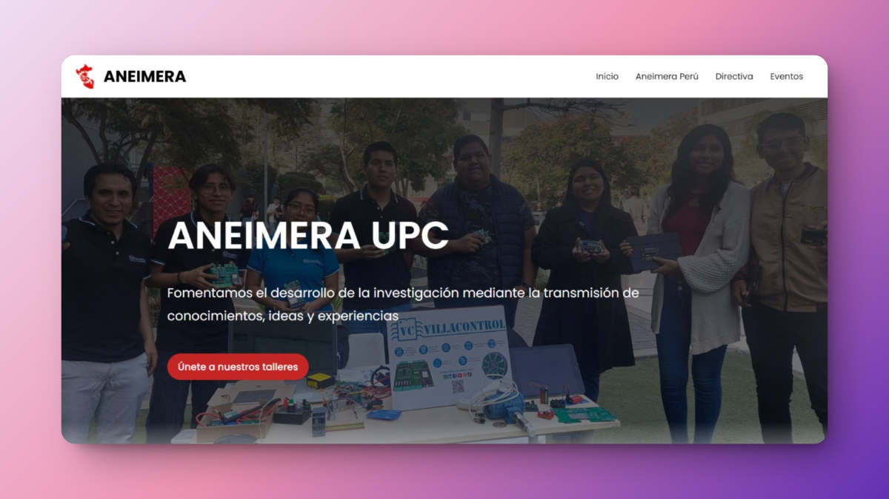
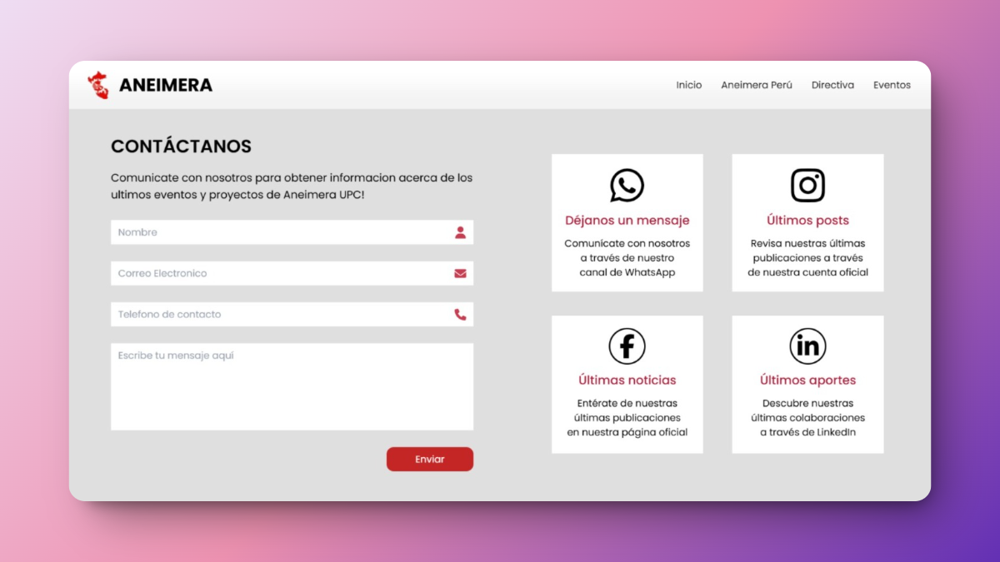
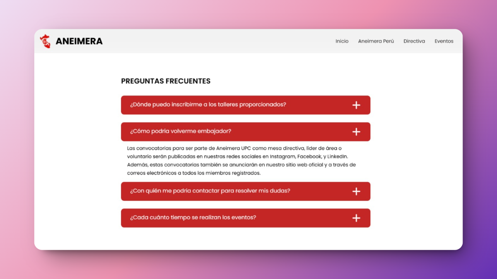
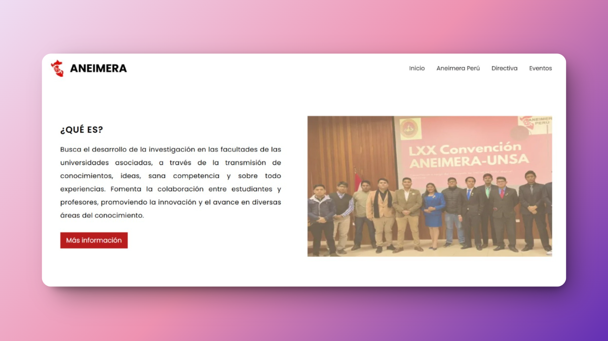
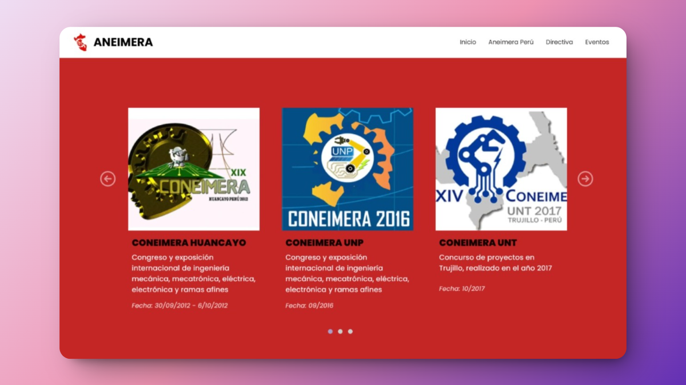
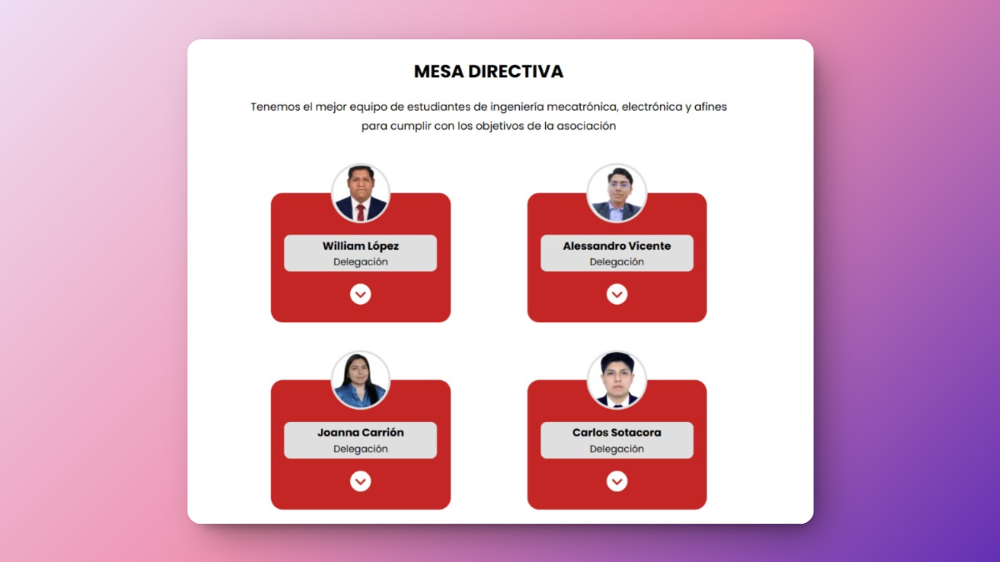
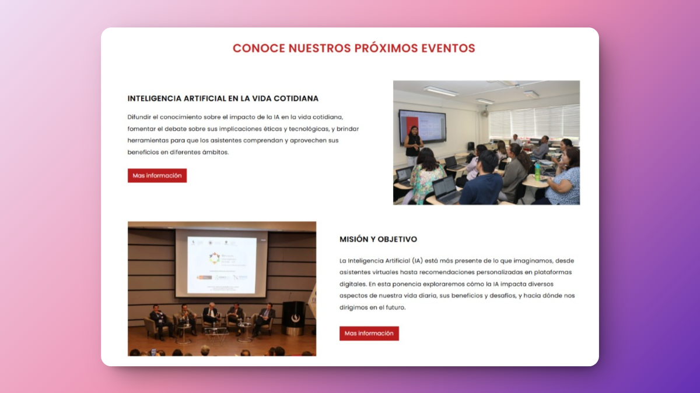
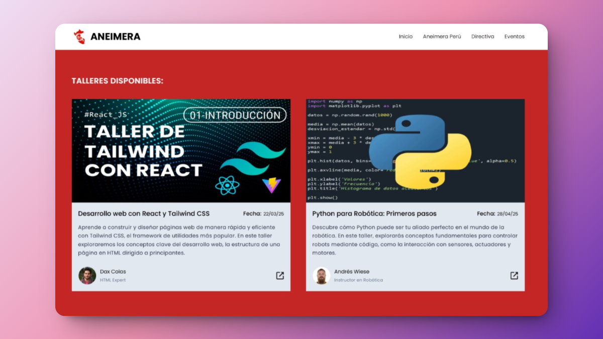
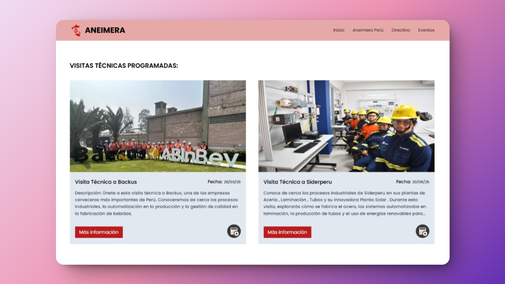

<p align="center">
  <a href="" rel="noopener">
 </a>
</p>
<h3 align="center">ANEIMERA UPC Website</h3>

---

<p align="center">
    Website oficial de ANEIMERA UPC, que presenta información sobre la asociación, su misión, objetivos, mesa directiva, eventos destacados y una sección dinámica de eventos gestionados a través de la <a href="https://github.com/Nekolas777/aneimera-upc-frontend">plataforma oficial</a>.  
    <br>  
    <br>
</p>


## 📝 Table of Contents

- [📝 Table of Contents](#-table-of-contents)
- [🧐 Problem Statement ](#-problem-statement-)
- [💡 Solution ](#-solution-)
- [🚀 How Does It Work? ](#-how-does-it-work-)
- [🏁 Getting Started ](#-getting-started-)
  - [1️⃣ Clonar el repositorio](#1️⃣-clonar-el-repositorio)
  - [2️⃣ Instalar dependencias](#2️⃣-instalar-dependencias)
  - [3️⃣ Configurar variables de entorno](#3️⃣-configurar-variables-de-entorno)
  - [4️⃣ Iniciar el servidor de desarrollo](#4️⃣-iniciar-el-servidor-de-desarrollo)
- [🎨 Screenshots \& Previews ](#-screenshots--previews-)
  - [🚀 Hero de Página Principal](#-hero-de-página-principal)
  - [📞 Sección de Contacto](#-sección-de-contacto)
  - [❓ Preguntas Frecuentes](#-preguntas-frecuentes)
  - [ℹ️ Acerca de Nosotros](#ℹ️-acerca-de-nosotros)
  - [🎉 Eventos Pasados](#-eventos-pasados)
  - [🏛️ Mesa Directiva](#️-mesa-directiva)
  - [🎙️ Próximas Ponencias](#️-próximas-ponencias)
  - [🛠️ Próximos Talleres](#️-próximos-talleres)
  - [🏭 Próximas Visitas Técnicas](#-próximas-visitas-técnicas)
- [📐 Project Structure ](#-project-structure-)
- [⛏️ Technology Stack ](#️-technology-stack-)
- [✍️ Authors ](#️-authors-)

## 🧐 Problem Statement <a name = "problem_statement"></a>

El website oficial de ANEIMERA UPC busca centralizar y comunicar información clave sobre la asociación, incluyendo su misión, objetivos, mesa directiva, eventos destacados y medios de contacto. Además, ofrece un espacio para la difusión de actividades académicas y profesionales, fortaleciendo la comunidad estudiantil y promoviendo la participación en iniciativas de impacto.

Este sitio web proporciona una solución organizada y dinámica para visibilizar la labor de ANEIMERA UPC, asegurando un acceso sencillo y actualizado a su información institucional y actividades relevantes.

## 💡 Solution <a name = "solution"></a>

Para optimizar la comunicación y difusión de información sobre ANEIMERA UPC, se ha desarrollado una landing page dinámica que permite centralizar y presentar de manera clara y accesible la misión, objetivos, mesa directiva, contacto y eventos más relevantes de la asociación.

Esta landing page ofrece una interfaz intuitiva, limpia y responsive, asegurando una experiencia de usuario fluida en distintos dispositivos. Además, incorpora una sección dinámica de eventos, actualizada en tiempo real para reflejar las actividades más recientes y mantener informada a la comunidad.

Con el objetivo de mejorar la accesibilidad y el impacto visual, se han implementado mecanismos de optimización de rendimiento y diseño adaptable, garantizando tiempos de carga reducidos y una navegación eficiente.


## 🚀 How Does It Work? <a name = "future_scope"></a>
 
- Los visitantes acceden al sitio web oficial para conocer más sobre ANEIMERA UPC, su propósito y actividades.  
- Pueden explorar eventos destacados, visitas técnicas y ponencias próximas a realizarse.  
- Cuentan con acceso a noticias, comunicados y actividades relevantes de la asociación.  
- Pueden encontrar información de contacto y formas de participación en ANEIMERA UPC.  
- La sección de eventos es dinámica, permitiendo que los usuarios siempre tengan acceso a las últimas actualizaciones.  

## 🏁 Getting Started <a name = "getting_started"></a>

### 1️⃣ Clonar el repositorio  
Abre una terminal y ejecuta: 

```bash
git clone https://github.com/Nekolas777/aneimera-upc-landing-page.git
cd aneimera-upc-landing-page
```

### 2️⃣ Instalar dependencias
Instala las dependencias del proyecto ejecutando:

```bash
npm install
```

### 3️⃣ Configurar variables de entorno
Copia el archivo `.env.template` a `.env` y ajusta las variables de entorno según sea necesario:

```bash
cp .env.template .env
```

### 4️⃣ Iniciar el servidor de desarrollo
Inicia el servidor de desarrollo ejecutando:

```bash
npm run dev
```

Ahora puedes abrir tu navegador y navegar a `http://localhost:4321` para ver la aplicación en funcionamiento.

## 🎨 Screenshots & Previews <a name="screenshots"></a>

### 🚀 Hero de Página Principal  


### 📞 Sección de Contacto  


### ❓ Preguntas Frecuentes  


### ℹ️ Acerca de Nosotros  


### 🎉 Eventos Pasados  


### 🏛️ Mesa Directiva  


### 🎙️ Próximas Ponencias  


### 🛠️ Próximos Talleres  


### 🏭 Próximas Visitas Técnicas  



## 📐 Project Structure <a name="project_structure"></a>

```
.
└── src
    ├── assets
    │   # Contiene recursos estáticos como imágenes y estilos.
    │
    ├── components
    │   # Componentes reutilizables para la interfaz de usuario.
    │
    ├── data
    │   # Datos estructurados utilizados en la página.
    │
    ├── environment
    │   # Configuración de variables de entorno y ajustes globales.
    │
    ├── helpers
    │   # Funciones auxiliares y utilidades reutilizables.
    │
    ├── interfaces
    │   # Definición de tipos e interfaces para estructurar datos.
    │
    ├── layouts
    │   # Diseños base para las páginas.
    │
    ├── pages
    │   # Páginas principales del sitio web.
    │
    ├── public
    │   # Contiene archivos públicos como favicon, imágenes y otros recursos.
    │
    ├── router
    │   # Configuración y gestión de rutas de la aplicación (si aplica).
    │
    ├── shared
    │   # Elementos compartidos como utilidades y tipos globales.
    │
    └── astro.config.mjs
        # Archivo de configuración de Astro.
```

## ⛏️ Technology Stack <a name="tech_stack"></a>

- [Astro](https://astro.build/) - Framework moderno para la creación de sitios web rápidos y optimizados.  
- [TypeScript](https://www.typescriptlang.org/) - Superset de JavaScript que añade tipado estático.  
- [Tailwind CSS](https://tailwindcss.com/) - Framework de CSS para el diseño de interfaces con clases utilitarias.  
- [View Transitions API](https://developer.mozilla.org/en-US/docs/Web/API/View_Transitions_API) - API para transiciones fluidas entre vistas en la web.  

## ✍️ Authors <a name = "authors"></a>

- [@Nekolas777](https://github.com/Nekolas777)
- [@sergio185678](https://github.com/sergio185678)
- [@asotito](https://github.com/asotito)
- [@KevinDextreMiguel](https://github.com/KevinDextreMiguel)